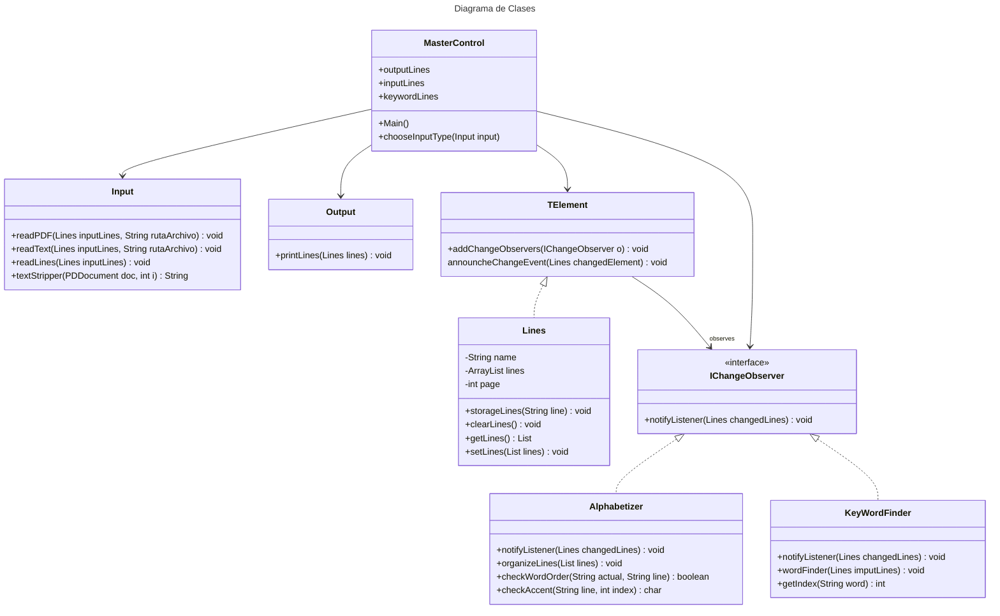

# GlosarioKeyWords

```mermaid
---
title: Diagrama de Clases
---
classDiagram
    MasterControl --> Input
    MasterControl --> Output
    MasterControl --> TElement
    TElement <|.. Lines
    TElement -->"observes" IChangeObserver
    IChangeObserver <|.. Alphabetizer
    IChangeObserver <|.. KeyWordFinder
    MasterControl --> IChangeObserver
    

    class MasterControl{
      +outputLines
      +inputLines
      +keywordLines
      +Main()
      +chooseInputType(Input input)
    }

    class TElement{
      +addChangeObservers(IChangeObserver o)void
      announcheChangeEvent(Lines changedElement)void
    }

    class IChangeObserver{
        <<interface>>
      +notifyListener(Lines changedLines) void
    }

    class KeyWordFinder{
        +notifyListener(Lines changedLines) void
        +wordFinder(Lines imputLines)void
        +getIndex(String word)int
    }   

    class Alphabetizer{
        +notifyListener(Lines changedLines) void
        +organizeLines(List<String> lines) void
        +checkWordOrder(String actual, String line)boolean
        +checkAccent(String line, int index)char
    }

    class Lines{
        -String name
        -ArrayList<String> lines
        -int page
        +storageLines(String line) void
        +clearLines()void
        +getLines()List<String>
        +setLines(List<String> lines)void
    }

    class Input{
        +readPDF (Lines inputLines, String rutaArchivo) void
        +readText (Lines inputLines, String rutaArchivo) void
        +readLines (Lines inputLines) void
        +textStripper (PDDocument doc, int i) String
    }

    class Output{
        +printLines(Lines lines) void
    }
```
